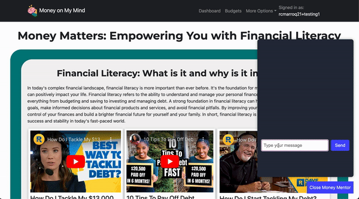

<h1 align="center">
  <br>

  <br>
  Money on My Mind
  <br>
</h1>

[![Contributors][contributors-shield]][contributors-url]
[![LinkedIn][linkedin-shield]][linkedin-url]

<!-- TABLE OF CONTENTS -->
<details>
  <summary>Table of Contents</summary>
  <ol>
    <li>
      <a href="#about-the-project">About The Project</a>
      <ul>
        <li><a href="#built-with">Built With</a></li>
        <li><a href="api-reference">API Reference</a></li>
      </ul>
    </li>
        <li><a href="#installation">Installation</a></li>
    <li><a href="#usage">Usage</a></li>
    <li><a href="#roadmap">Roadmap</a></li>
    <li><a href="#contributing">Contributing</a></li>
    <li><a href="#contact">Contact</a></li>
    <li><a href="#acknowledgments">Acknowledgments</a></li>
  </ol>
</details>

<!-- ABOUT THE PROJECT -->

## About The Project


As someone who is low income and has watched people spiral into debt, I have seen many people around me have trouble with managing their finances, which has led them into overspending, debt buildup, and difficulty saving for long-term goals and retirement. In order to stop this cycle, I want to build an informative, free application that helps people plan their budgets to make informed financial decisions and achieve financial stability.

Here's why:

- Money on My Mind has a user-friendly interface to make it easy for technical and non-technical people to use.
- Expense and income tracking is offered so that you can view your finances as a table or as a chart if you like visuals.
- Provide an informative, financial literacy tab with an in-app chat bot that you can ask for financial advice.
- Get a Google Calendar invite for upcoming expenses with due dates so that you don't forget!

### Built With

- 
- 
- [![React][React.js]][React-url]
- 
- 
- [![Bootstrap][Bootstrap.com]][Bootstrap-url]
- 
- 

<!-- API Reference -->

## API Reference

- [Google Calendar API](https://developers.google.com/calendar/api/guides/overview)
- [OpenAI GPT-3 API](https://platform.openai.com/docs/api-reference)
- [YouTube API](https://developers.google.com/youtube/v3)

<!-- Database Schema -->

## Database Schema


<!-- Installation -->

## Installation

**This project requires Auth0! Please visit [Auth0](https://auth0.com/) to make an account and retrieve a domain and clientid. See .env.example for set up!**

Step 1: Go to your terminal: clone the project and switch into the project directory.

```bash
  git clone https://github.com/rubycmarroquin/MoneyOnMyMind.git
  cd moneyonmymind
```

Step 2: Install all packages.

```bash
  cd client && npm install && cd ../server && npm install
```

Step 3: Setup Environment Variables

- Copy the instructions from both .env.example files in the client and server.

Step 4: Connect the database and the data.

```bash
  cd server
  psql moneyonmymind -f db.sql
```

Step 5: Start the program!

```bash
  cd server && npm run dev
```

<!-- USAGE EXAMPLES -->

## Usage

### Testing Account

testingaccount+1@gmail.com
<br>
TestAccount23!

### Get started!

Create an account with our secure login powered by Auth0!


### Dashboard

When first logging in, users can see the current month/year's spending breakdown. Users are also able to switch between months and years where our charts that have been generated using React Google Charts and table are dynamically updated based on the month/year selected.


### Budget

In the Budget's page, users are prompted to select a month and year for which they want to add an expense or income to. Users can edit an expense that has already been added or delete it!


Additionally, users are offered a "bell" option that allows them to get a Google calendar invitation that is generated using Google Calendar API! (never forget to pay your bills again~) The calendar invite is only available if an expense has a due date and if the date has not already passed (e.g., If it is May 25th, 2023 you cannot get one for January 1st, 2023). DISCLAIMER: If you want to use the calendar invite, you must use a valid email address during sign up!


### Financial Literacy

Become informed, or watch some informative videos. The Financial Literacy Page is there to help educate to empower you to make good financial decisions! The videos displayed are rendered using the YouTube API and can change depending on video popularity, video deletion, etc...


The real show stopper of the Financal Literacy Page is "Money Mentor"! Money Mentor? You may ask, is an in-app chatbot that is powered by OpenAI API that provides financial advice based on a user's inquiry. (disclaimer: response times may vary depending on OpenAI API usage)



### Account Settings

In the Account Settings, users are able to provide some basic information such as a name or phone number, not required. Additionally, users can request a password reset email that is generated using Auth0 Management API to securely change your password.


## Roadmap

- [x] Create Dashboard
  - [x] Display a summary of user spending using Google Charts React Library
    - [x] Current month uses Donut Chart
    - [x] Year overview using Combo Chart
  - [x] Display a table of the expenses
  - [x] Allow the user to switch between months and years
- [x] Create Budget Page
  - [x] Let users add, modify and delete income items
  - [x] Let users add, modify and expense income items
  - [x] Allow users to select each month and year they want to add to
  - [x] Button that allows users to receive a google calendar invite for expenses with upcoming due dates.
    - [x] Generate calendar invite using Google Calendar API
- [x] Create Account Settings Page
  - [x] Reset password email
  - [x] Form for user's name and phone number
- [x] Financial Literacy Page
  - [x] Display financial videos using YouTube API
  - [x] In-app chat bot based with scope to finance using OpenAI API

<!-- CONTRIBUTING -->

## Contributing

In case you have a suggestion to improve the project, you can either fork the repository and initiate a pull request or raise an issue labeled as "enhancement".

<!-- ABOUT THE DEVELOPER -->

## About the Developer

Hey there! My name is Ruby Marroquin and my pronouns are she/her. I am from Los Angeles, California. After high school I went to community college, where I used to tutor in mathematics and eventually got my associates in math. I decided to pursue higher education and was the first in my family to attend university. I went to UC San Diego and was part of the Jacobs School of Engineering, where I planned on getting a computer science degree despite having a math background. Ultimately, the program was too expensive for me to stay, but that did not deter me from seeking a way into tech, which is how I ended up at Techtonica. Thank you for reading & I hope you enjoy Money on My Mind!

<!-- CONTACT -->

## Contact

- Project Link: [Money on My Mind](server-ps6p.onrender.com)

- GitHub Link: [Money on My Mind](https://github.com/rubycmarroquin/MoneyOnMyMind)

<!-- ACKNOWLEDGMENTS -->

## Acknowledgments

- [Img Shields](https://shields.io)
- [Font Awesome](https://fontawesome.com)
- [React Icons](https://react-icons.github.io/react-icons/search)

<p align="right">(<a href="#about-the-project">back to top</a>)</p>

<!-- MARKDOWN LINKS & IMAGES -->

[contributors-shield]: https://img.shields.io/badge/Contributors-1-brightgreen?style=for-the-badge&logo=appveyor
[contributors-url]: https://github.com/rubycmarroquin/MoneyOnMyMind/graphs/contributors
[linkedin-shield]: https://img.shields.io/badge/linkedin-%230077B5.svg?style=for-the-badge&logo=linkedin&logoColor=white
[linkedin-url]: https://www.linkedin.com/in/rubymarroquin/
[React.js]: https://img.shields.io/badge/React-20232A?style=for-the-badge&logo=react&logoColor=61DAFB
[React-url]: https://reactjs.org/
[Bootstrap.com]: https://img.shields.io/badge/Bootstrap-563D7C?style=for-the-badge&logo=bootstrap&logoColor=white
[Bootstrap-url]: https://getbootstrap.com
